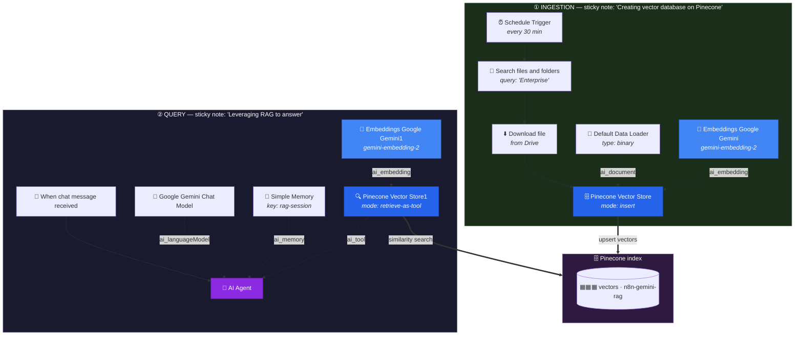

<div align="center">

# 🔍 NextLeap — RAG Implementation: Pinecone Vector DB + Gemini Embeddings

**A complete Retrieval-Augmented Generation pipeline in n8n. A scheduled job ingests documents from Google Drive, embeds them with Gemini, and stores the vectors in Pinecone. A chat agent then answers questions by searching that index as a tool — the full RAG loop, end to end.**

[](https://en.wikipedia.org/wiki/Retrieval-augmented_generation)
[](https://n8n.io)
[](https://www.pinecone.io)
[](https://ai.google.dev)
[](https://developers.google.com/drive)
[](LICENSE)

</div>

---

## 📖 Overview

This repository contains one n8n workflow implementing **RAG (Retrieval-Augmented Generation)** — the standard way to make an LLM answer questions about *your* documents instead of relying on its training data.

**File:** [`RAG implementation - Pinecone vector DB + Gemini embeddings.json`](RAG%20implementation%20-%20Pinecone%20vector%20DB%20%2B%20Gemini%20embeddings.json) · 14 nodes

### Why RAG exists

An LLM knows nothing about your private documents, and fine-tuning is expensive and rigid. RAG solves this by **retrieving relevant passages at question time** and putting them in the prompt.

```text
Without RAG:   Question ──────────────────────────► LLM ──► ❌ "I don't know"

With RAG:      Question ──► embed ──► vector search ──► top passages ──┐
                                                     │                 ▼
               Answer ◄── LLM ◄── prompt + passages ◄────────────────┘
```

The model never learns your data. It just *reads* it at the moment it's needed — which means you can update a document and the change is live immediately, with no retraining.

### The two halves of this workflow

RAG is really **two pipelines that happen to share a vector database**. n8n keeps them in one workflow, separated by sticky notes:

| Pipeline | Trigger | Job | Runs |
| --- | --- | --- | --- |
| **① Ingestion** | ⏰ Schedule Trigger | Drive → chunk → embed → **upsert to Pinecone** | Every 30 min |
| **② Query** | 💬 Chat Trigger | Question → embed → **search Pinecone** → LLM answers | On demand |

> ⚠️ **Most RAG bugs live in the seam between these two halves** — specifically, using *different embedding models* on each side. See [The Golden Rule](#-the-golden-rule).

---

## 🏗️ Architecture



### Retrieval as a tool

The single most important design decision in the query half:

```json
"mode": "retrieve-as-tool"
```

This exposes the vector store to the AI Agent as a **tool** rather than hard-wiring retrieval into the chain. The agent decides whether a question actually needs your documents — which saves a vector search on small talk, and lets it search multiple times for a multi-part question.

| Mode | Behaviour | Use when |
| --- | --- | --- |
| `retrieve-as-tool` ✅ | Agent chooses when to search | You want an agent that may or may not need the docs *(this repo)* |
| `retrieve-as-rag` | Always retrieves, then answers | Every question is doc-based; simpler and more predictable |

---

## 📋 Node Reference

### ① Ingestion

| Node | Type | v | Role |
| --- | --- | --- | --- |
| **Schedule Trigger** | `scheduleTrigger` | 1.3 | Runs every 30 minutes (`interval: [{}]`) |
| **Search files and folders** | `googleDrive` | 3 | `resource: fileFolder`, query `"Enterprise"`, root folder |
| **Download file** | `googleDrive` | 3 | `operation: download` — fetches the binary |
| **Pinecone Vector Store** | `vectorStorePinecone` | 1.3 | `mode: insert` → index `n8n-gemini-rag` |
| **Default Data Loader** | `documentDefaultDataLoader` | 1.1 | `dataType: binary` — extracts text from the file |
| **Embeddings Google Gemini** | `embeddingsGoogleGemini` | 1 | `models/gemini-embedding-2` |

### ② Query

| Node | Type | v | Role |
| --- | --- | --- | --- |
| **When chat message received** | `chatTrigger` | 1.4 | Chat entry point |
| **AI Agent** | `agent` | 3.1 | Orchestrates search + answer (no fixed prompt) |
| **Google Gemini Chat Model** | `lmChatGoogleGemini` | 1.1 | The answering LLM |
| **Simple Memory** | `memoryBufferWindow` | 1.3 | `sessionIdType: customKey`, `sessionKey: rag-session` |
| **Pinecone Vector Store1** | `vectorStorePinecone` | 1.3 | `mode: retrieve-as-tool` → index `n8n-gemini-rag` |
| **Embeddings Google Gemini1** | `embeddingsGoogleGemini` | 1 | `models/gemini-embedding-2` |

### The tool description

The vector store's description is what the agent reads to decide whether to search:

> Use this tool to retrieve relevant product documentation to answer any questions on the product

Same lesson as the [MCP workshop](https://github.com/Gursimaran21/NextLeap-Built-MCP-Server-and-Client-04-October-2026): **the description is the prompt.** It only works if it accurately describes what's actually in the index — see [Bugs](#-known-bugs-in-this-workflow) below.

### Credentials required

| Credential | Used by | Notes |
| --- | --- | --- |
| **Google Drive account** | Search + Download | Scope: `https://www.googleapis.com/auth/drive` |
| **Pinecone account** | Both vector store nodes | API key from [pinecone.io](https://www.pinecone.io) |
| **Google Gemini (PaLM) API** | Chat model + both embeddings | One key can serve all three nodes |

> The original export referenced **two different** Google Drive credentials on the same workflow — almost certainly an artefact of the live session. A single credential works fine for both nodes.

---

## 🔐 The Golden Rule

> **The model that embeds a document must be the exact same model that embeds the question.**

A vector is only comparable to another vector if both were produced by the same model, at the same dimensionality, in the same space. Mix `gemini-embedding-2` on the ingestion side with a different model on the query side and **retrieval fails silently** — you get results, they're just meaningless. No error, no warning.

That's why this workflow has **two separate Embeddings nodes** (`Embeddings Google Gemini` and `Embeddings Google Gemini1`). n8n attaches sub-nodes per usage site, so you must configure both — and keep them identical.

**If you ever change the embedding model, you must re-embed the entire corpus.** Mixing vectors from two models in one index will quietly corrupt your results.

---

## 🚨 Known bugs in this workflow

The workflow works as a teaching example, but shipping it as-is will bite you. Four real issues, found by reading the export:

### 1. 🔴 The Drive search is decorative

`Search files and folders` queries Drive for `"Enterprise"` — but `Download file` **ignores its input** and uses a hardcoded `fileId`:

```json
"fileId": {
  "__rl": true,
  "value": "YOUR_GOOGLE_DRIVE_FILE_ID",
  "mode": "list"
}
```

So the same single document is ingested every run, no matter what the search returned. The search step does nothing.

**Fix** — switch the File ID to expression mode:

```js
={{ $json.id }}
```

That takes the ID from each search result, making the pipeline genuinely dynamic.

### 2. 🔴 Duplicates accumulate every 30 minutes

`Schedule Trigger` fires every 30 minutes with `mode: insert`. Pinecone's insert creates **new** vectors every time — it never overwrites. Your index will fill with hundreds of copies of the same document, and retrieval will return near-duplicates.

**Fixes** — pick one:

- Use **upsert** mode with a deterministic ID (e.g. a hash of the file ID + chunk index) so re-runs overwrite.
- Add a **filter** on the update path to delete old vectors for that document first.
- Or simply run ingestion **on demand** rather than on a timer.

### 3. 🟡 No text splitting

The document goes from `Default Data Loader` straight into the vector store. There is **no `Document Splitter` node**, so a large document becomes one enormous chunk — which embeds poorly and wastes tokens on every query.

**Fix** — insert a **Document Splitter** (`recursiveCharacterTextSplitter`) between the loader and the vector store, set to ~1000 characters with ~100 overlap.

### 4. 🟡 Memory is shared by every user

```json
"sessionIdType": "customKey",
"sessionKey": "rag-session"
```

`rag-session` is a **fixed** key, so every visitor to the chat shares one conversation history. Person A's questions leak into Person B's context.

**Fix** — key memory off the chat session instead:

```js
"sessionKey": "={{ $('When chat message received').item.chatId }}"
```

### 5. 🟡 Tool description doesn't match the corpus

The description says *"product documentation"*, but the ingested document is `india-news-podcast-PRD.md` — a news-podcast PRD. The agent will look for product docs that don't exist.

**Fix** — describe what's actually indexed:

> Use this tool to search the project PRD and internal documentation for details about the India news podcast.

---

## 🚀 Setup Guide

### Step 1 — Create the Pinecone index

1. Sign in at [app.pinecone.io](https://app.pinecone.io).
2. **Create Index** → name it `n8n-gemini-rag` (or update the workflow to match).
3. **Dimension** must match your embedding model. Check Google's docs for `gemini-embedding-2` and use that value — a mismatch here is the single most common RAG setup failure.
4. **Metric:** `cosine` (the usual default).

> 💡 Run the ingestion half once successfully *before* building the query half. You should see vector count climb in the Pinecone console. An empty index makes the chat look broken for reasons that have nothing to do with the agent.

### Step 2 — Import and attach credentials

1. **Workflows → Import from File** → the workflow JSON.
2. Create and attach:

   | Credential | How |
   | --- | --- |
   | Google Drive | OAuth 2.0 with `drive` scope |
   | Pinecone | API key from the Pinecone console |
   | Google Gemini | API key from [aistudio.google.com/apikey](https://aistudio.google.com/apikey) |

3. Open both **Pinecone Vector Store** nodes and select your index.

### Step 3 — Point ingestion at your own document

Open **Download file → File** and pick a document from your Drive. The committed value is the placeholder `YOUR_GOOGLE_DRIVE_FILE_ID`.

> Or fix [bug #1](#1--the-drive-search-is-decorative) above and let the search drive it automatically.

### Step 4 — Run the ingestion half

Select from **Schedule Trigger** through **Pinecone Vector Store**, then hit **Execute Workflow**. Confirm:

- The Drive node returns your file
- The embeddings node produces vectors
- Pinecone's vector count increases

### Step 5 — Activate and chat

1. Click **Active**.
2. Open the chat and ask something only your document can answer.
3. Open the execution log — you'll see the vector store appear as a **tool call**, followed by the Gemini answer.

### Step 6 — Fix the known bugs

Work through [Known bugs](#-known-bugs-in-this-workflow) above. At minimum, fix **#1** and **#2**, or the pipeline will quietly misbehave.

---

## 🎬 Demo Prompts

Once indexed, try questions that test whether retrieval is genuinely working:

```text
✅  What is this project's target audience?          ← answerable only from the doc
✅  Summarise the key milestones in this PRD.        ← good multi-passage test
✅  What are the open questions still listed?        ← tests metadata retrieval

⚠️  What is the capital of France?     ← correct behaviour is to NOT call the tool
⚠️  Summarise it.                     ← follow-up; tests memory + a second search
```

> 💡 The third case is the interesting one. Because the store is a **tool**, the agent should answer "I don't have that in the document" rather than hallucinating. If it makes something up, your tool description or embedding setup needs work.

---

## 🔧 Troubleshooting

| Symptom | Likely cause | Fix |
| --- | --- | --- |
| `Could not find embedding model` | Invalid/unsupported model ID | Verify the exact ID in [Google's model list](https://ai.google.dev/gemini-api/docs/models) |
| Answers ignore the document | Chat + embedding models mismatch | Confirm **both** embeddings nodes use the same model |
| Pinecone rejects the upsert | Wrong dimension for the index | Recreate the index at the model's dimension |
| Retrieval returns junk | Vectors in the index came from a different model | Delete the index and re-embed everything |
| Near-duplicate results | [Bug #2](#2--duplicates-accumulate-every-30-minutes) — repeated inserts | Switch to upsert with deterministic IDs |
| Same document every run | [Bug #1](#1--the-drive-search-is-decorative) — hardcoded file ID | Set File ID to `={{ $json.id }}` |
| One giant chunk retrieved | [Bug #3](#3--no-text-splitting) | Add a Document Splitter node |
| Chat "knows" other users' questions | [Bug #4](#4--memory-is-shared-by-every-user) | Key memory off `chatId` |
| Agent never calls the tool | Tool description doesn't match the question | Rewrite the description to name your actual content |
| Empty index | Ingestion half never ran successfully | Run it manually first; check the Drive node |
| Dimension mismatch errors | Pinecone index built for another model | Index dimension must equal the embedding model's output size |

---

## 📊 Choosing a Vector Database

Pinecone isn't the only option — it's just fully managed and the least setup friction.

| | Pinecone | Qdrant | Weaviate | pgvector |
| --- | --- | --- | --- | --- |
| Hosting | Managed / Self / Cloud | Self / Cloud | Self / Cloud | Postgres extension |
| Setup effort | None | Low | Medium | Low (if you have PG) |
| Local dev | ✖ | ✅ | ✅ | ✅ |
| Best for | Fastest to prototype | Self-host + speed | Rich hybrid search | Already have Postgres |
| n8n support | ✅ Built-in node | ✅ | ✅ | via vector store nodes |

> Switching later is mostly a node swap — the workflow logic doesn't change.

---

## 🚀 Ideas to Extend

- ➕ **Add a Document Splitter** — the single biggest quality win ([bug #3](#3--no-text-splitting))
- 🔁 **Switch to upsert** with deterministic IDs so re-ingestion is idempotent
- 💬 **Fix the memory key** so each chat session is isolated ([bug #4](#4--memory-is-shared-by-every-user))
- 📎 **Ingest PDFs and Notion/Confluence pages** — swap the Drive node, keep the rest
- 🔀 **Hybrid search** — combine vector similarity with Pinecone's keyword search for better recall
- 📝 **Add citations** — have the agent cite which passages it used, so answers are auditable
- 🚦 **Add a relevance threshold** — if the top match scores below X, say "not in the document" instead of guessing
- 📊 **Log queries + top hits** to a sheet, then review which questions RAG failed to answer

---

## 📂 Project Structure

```text
NextLeap-RAG-Implementation-Pinecone-Vector-DB-Gemini-Embeddings-05-October-2026/
├── RAG implementation - Pinecone vector DB + Gemini embeddings.json
├── README.md
└── LICENSE
```

### The 14 nodes at a glance

| Count | Type |
| --- | --- |
| 1 | `scheduleTrigger` |
| 2 | `googleDrive` (search + download) |
| 2 | `vectorStorePinecone` (insert + retrieve-as-tool) |
| 2 | `embeddingsGoogleGemini` |
| 1 | `documentDefaultDataLoader` |
| 1 | `chatTrigger` |
| 1 | `agent` |
| 1 | `lmChatGoogleGemini` |
| 1 | `memoryBufferWindow` |
| 2 | `stickyNote` (label each pipeline) |

> ✅ This workflow ships **scrubbed** — no credential UUIDs, no real Drive file IDs, no instance fingerprint. See the [sharing guide](https://github.com/Gursimaran21/NextLeap-Building-N8N-Workflows-and-sharing-on-Github-04-October-2026) for the checklist.

---

## 🎓 Workshop Context

Part of a **NextLeap AI Engineer bootcamp** series.

| Segment | Focus |
| --- | --- |
| Sample Workflows — RAG | Vector stores, embeddings, retrieval-as-tool, Pinecone |

### Session map

| # | Repo | Introduced |
| --- | --- | --- |
| 1 | [Google Calendar AI Assistant](https://github.com/Gursimaran21/NextLeap-Google-Calendar-Assistant-04-October-2026) | Single agent + tools |
| 2 | [Build MCP Server and Client](https://github.com/Gursimaran21/NextLeap-Built-MCP-Server-and-Client-04-October-2026) | MCP — tools over a standard |
| 3 | [Multi-Agent System — Newsletter Agent](https://github.com/Gursimaran21/NextLeap-Multi-Agent-System-Newsletter-Aagent-04-October-2026) | Multi-agent orchestration |
| 4 | [Building & Sharing n8N Workflows](https://github.com/Gursimaran21/NextLeap-Building-N8N-Workflows-and-sharing-on-Github-04-October-2026) | Building & publishing workflows |
| 5 | **This repo** | RAG, embeddings, vector stores |

**Key takeaways:**

- **RAG = two pipelines sharing one vector store.** Build and verify ingestion *first*; a broken index looks exactly like a broken agent.
- **One embedding model, everywhere.** Mismatch fails silently, not loudly.
- **The vector store is just another tool.** Same `ai_tool` port as Gmail or Pinecone-adjacent tools — and the description still governs whether it gets called.

---

## 📄 License

Released under the [MIT License](LICENSE).

---

## 👤 Author

**Gursimaran** — [GitHub @Gursimaran21](https://github.com/Gursimaran21)

---

## 🔗 Resources

- [n8n RAG template](https://n8n.io/workflows) · [Vector Store docs](https://docs.n8n.io)
- [Pinecone docs](https://docs.pinecone.io) · [Pinecone console](https://app.pinecone.io)
- [Gemini embedding models](https://ai.google.dev/gemini-api/docs/models)
- [RAG fundamentals](https://en.wikipedia.org/wiki/Retrieval-augmented_generation)

---

<div align="center">

**Built with 🔍, 🗄️ and a lot of silent similarity-search failures.**

</div>